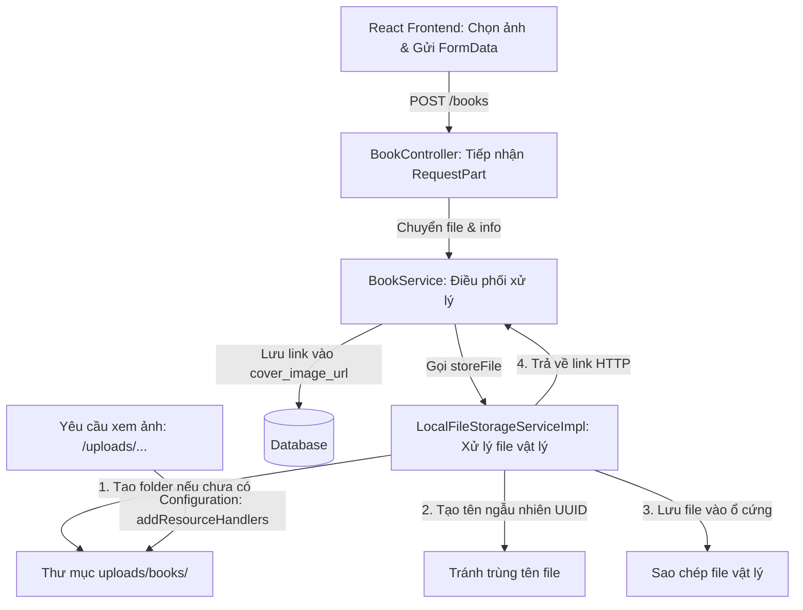

# Hướng Dẫn Xử Lý Tải Ảnh Bìa Sách (Local Image Storage)

Tài liệu này giải thích chi tiết luồng xử lý tải ảnh bìa sách từ Frontend (React) lên Backend (Spring Boot), lưu trữ ảnh trực tiếp tại máy chủ và trả về link tĩnh hiển thị cho Client. Đây là một phần kiến thức hữu ích cho việc bảo vệ đồ án tốt nghiệp.

---

## 🗺️ Tổng Quan Luồng Đi Của Ảnh Bìa



---

## 🛠️ Chi Tiết Các Thành Phần Code Của Hệ Thống

### 1. Phía Frontend (React)
Frontend đóng gói file ảnh và thông tin của cuốn sách dưới dạng `FormData` (tương đương định dạng `multipart/form-data`) rồi gửi qua API:
```javascript
const formData = new FormData();
if (coverImage) {
  formData.append('file', coverImage); // Đính kèm file ảnh bìa
}
// Chuyển đối tượng JSON của sách thành Blob có kiểu application/json
formData.append('request', new Blob([JSON.stringify(bookData)], { type: 'application/json' }));
```

---

### 2. Phía Backend (Spring Boot)

#### 🔹 A. Tiếp Nhận Request Tại Controller
* **File:** [BookController.java](file:///d:/Files/ALUANVANTOTNGHIEP/LV_BACKEND/lv_backend/src/main/java/org/example/lv_backend/controller/BookController.java)
* **Chi tiết code:**
  ```java
  @PostMapping(consumes = org.springframework.http.MediaType.MULTIPART_FORM_DATA_VALUE)
  public ApiResponse<BookResponse> createBook(
          @RequestPart(value = "file", required = false) MultipartFile file,
          @RequestPart("request") @Valid BookCreationRequest request) {
      return ApiResponse.<BookResponse>builder()
              .result(bookService.createBook(request, file))
              .build();
  }
  ```
* **Giải thích:** Sử dụng `@RequestPart` để Spring Boot bóc tách đồng thời file nhị phân (`MultipartFile file`) và thông tin dạng JSON (`BookCreationRequest request`) gửi từ Client.

#### 🔹 B. Điều Phối Nghiệp Vụ Tại Service
* **File:** [BookService.java](file:///d:/Files/ALUANVANTOTNGHIEP/LV_BACKEND/lv_backend/src/main/java/org/example/lv_backend/service/BookService.java)
* **Chi tiết code:**
  ```java
  // Lưu file cục bộ và lấy đường dẫn URL
  String imageUrl = fileStorageService.storeFile(file);
  if (imageUrl != null) {
      request.setCoverImageUrl(imageUrl);
  }
  // ... xử lý map DTO và lưu vào cơ sở dữ liệu
  ```
* **Giải thích:** `BookService` áp dụng nguyên lý đơn nhiệm (Single Responsibility Principle) trong lập trình. Nó không trực tiếp can thiệp vào cách ghi file vật lý mà uỷ thác (delegate) cho lớp `FileStorageService`.

#### 🔹 C. Cấu Trúc Thiết Kế Lưu Trữ (Strategy Pattern)
Hệ thống sử dụng Interface [FileStorageService.java](file:///d:/Files/ALUANVANTOTNGHIEP/LV_BACKEND/lv_backend/src/main/java/org/example/lv_backend/service/FileStorageService.java) để làm hợp đồng thiết kế, giúp sau này nếu muốn chuyển từ lưu file trên server sang lưu trên Cloud (như AWS S3, Cloudinary) chỉ cần đổi lớp triển khai (Implementation) mà không cần sửa code của `BookService`.

Lớp hiện tại đang thực thi lưu cục bộ:
* **File:** [LocalFileStorageServiceImpl.java](file:///d:/Files/ALUANVANTOTNGHIEP/LV_BACKEND/lv_backend/src/main/java/org/example/lv_backend/service/LocalFileStorageServiceImpl.java)
* **Chi tiết xử lý:**
  1. **Kiểm tra hợp lệ:**
     ```java
     if (file == null || file.isEmpty()) return null;
     ```
     Nếu không đính kèm ảnh bìa, bỏ qua việc ghi file và trả về `null`.
  2. **Chuẩn bị thư mục chứa:**
     ```java
     String uploadDir = "uploads/books/";
     Path uploadPath = Paths.get(uploadDir);
     if (!Files.exists(uploadPath)) {
         Files.createDirectories(uploadPath); // Tạo thư mục nếu chưa tồn tại
     }
     ```
  3. **Lấy đuôi file gốc:**
     ```java
     String originalFilename = file.getOriginalFilename(); // VD: "anh-bia-sach.png"
     String extension = originalFilename.substring(originalFilename.lastIndexOf(".")); // Cắt lấy ".png"
     ```
  4. **Sinh tên file ngẫu nhiên (UUID):**
     ```java
     String newFilename = UUID.randomUUID().toString() + extension; // VD: "9b1deb4d-3b7d-4bad-9bdd-2b0d7b3dcb6d.png"
     ```
     *Mục đích:* Tạo định danh duy nhất toàn cầu cho ảnh, tránh hiện tượng ghi đè tệp tin khi hai người dùng cùng tải lên các tệp trùng tên.
  5. **Sao chép dữ liệu vật lý:**
     ```java
     Path filePath = uploadPath.resolve(newFilename);
     Files.copy(file.getInputStream(), filePath, StandardCopyOption.REPLACE_EXISTING);
     ```
     Đọc luồng dữ liệu nhị phân đầu vào và dán (Paste) vào ổ đĩa.
  6. **Trả về đường dẫn HTTP tĩnh:**
     ```java
     return "http://localhost:8080/uploads/books/" + newFilename;
     ```

#### 🔹 D. Cho Phép Truy Cập File Tĩnh Qua WebMvcConfigurer
* **File:** [Configuration.java](file:///d:/Files/ALUANVANTOTNGHIEP/LV_BACKEND/lv_backend/src/main/java/org/example/lv_backend/configuration/Configuration.java)
* **Chi tiết code:**
  ```java
  @Override
  public void addResourceHandlers(ResourceHandlerRegistry registry) {
      registry.addResourceHandler("/uploads/**")
              .addResourceLocations("file:uploads/");
  }
  ```
* **Giải thích:** Cấu hình này ánh xạ các request có URL bắt đầu bằng `/uploads/**` tới trực tiếp thư mục vật lý `uploads/` trên máy chủ. Nhờ vậy, Client hoặc Frontend có thể xem trực tiếp bức ảnh qua đường dẫn HTTP từ Backend.

---

## 🎓 Tóm Tắt Cách Báo Cáo Đồ Án (Dành cho Sinh Viên)
Khi Hội đồng chấm đồ án hỏi về **cơ chế xử lý ảnh bìa**, bạn có thể trả lời như sau:
1. **Frontend:** Client đóng gói dữ liệu và file vào `FormData` có kiểu truyền tải là `multipart/form-data`.
2. **Backend (Controller & Service):** Spring Boot bóc tách file bằng `@RequestPart` và sử dụng mẫu thiết kế **Strategy Pattern** (`FileStorageService`) để dễ chuyển đổi dịch vụ lưu trữ sau này.
3. **Lưu trữ vật lý:** File được kiểm tra tính hợp lệ, đổi tên thành chuỗi định danh ngẫu nhiên bằng **UUID** để tránh xung đột trùng tên và lưu trực tiếp vào đĩa cứng của server tại thư mục `uploads/books/`.
4. **Hiển thị tĩnh:** Cấu hình `WebMvcConfigurer` của Spring Boot giúp ánh xạ URL `/uploads/**` tới thư mục vật lý để trả ảnh về cho trình duyệt hiển thị thông qua giao thức HTTP.